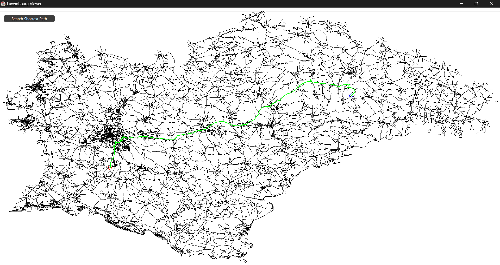

# LuxembourgViewer



**LuxembourgViewer** is a C++ project using the Qt framework for calculating the shortest path between two nodes on a map using Dijkstra's algorithm. The program reads an XML file containing nodes and edges, displays the graph on the screen, and allows the user to select the start and end nodes interactively. The shortest path is then calculated and displayed on the map.

[Video Presentation](presentation.mp4)

## Prerequisites

- **Qt Framework (MSVC 64-bit compiler)**
- **Visual Studio**
- **Qt Visual Studio Tools Extension**

## Installation

### 1. Install Qt Framework

1. Download and install the [Qt Framework](https://www.qt.io/download).
2. During installation, ensure you select the **MSVC 2019 64-bit** compiler.

### 2. Install Visual Studio

1. Download and install [Visual Studio](https://visualstudio.microsoft.com/).
2. Ensure that the **Desktop development with C++** workload is selected during installation.

### 3. Install Qt Visual Studio Tools Extension

1. Open Visual Studio.
2. Navigate to **Extensions** > **Manage Extensions**.
3. Search for "Qt Visual Studio Tools" and install it.
4. Restart Visual Studio to apply the changes.

## Usage

1. Clone the LuxembourgViewer repository to your local machine:

   ```bash
   git clone https://github.com/tbtiberiu/LuxembourgViewer.git
   ```

2. Open Visual Studio and go to File > New > Project From Existing Code.

3. Select Visual C++ as the project type and follow the wizard to import the LuxembourgViewer project.

4. Run the application within Visual Studio (`CTRL` + `F5` on Windows)

5. Left Click on the map to select the starting node (red dot). Right Click on the map to select the ending node (blue dot). The program will calculate and display the shortest path using Dijkstra's algorithm.

<p align="center">
  
</p>
